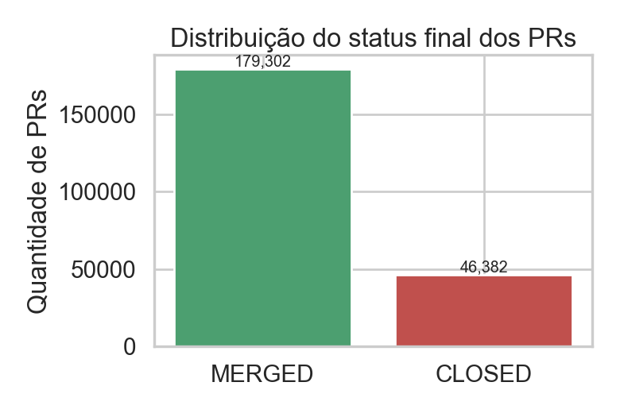
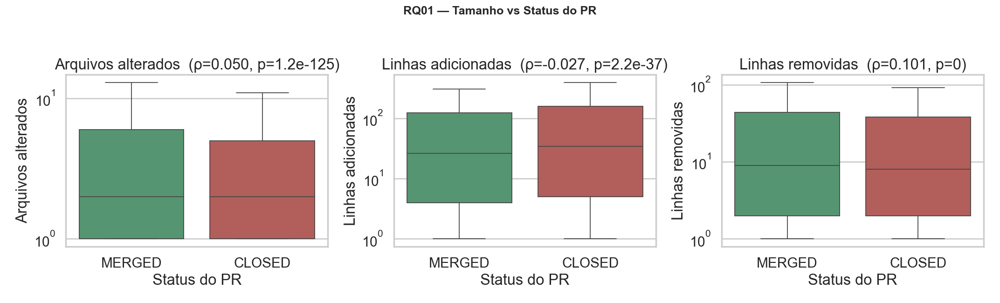
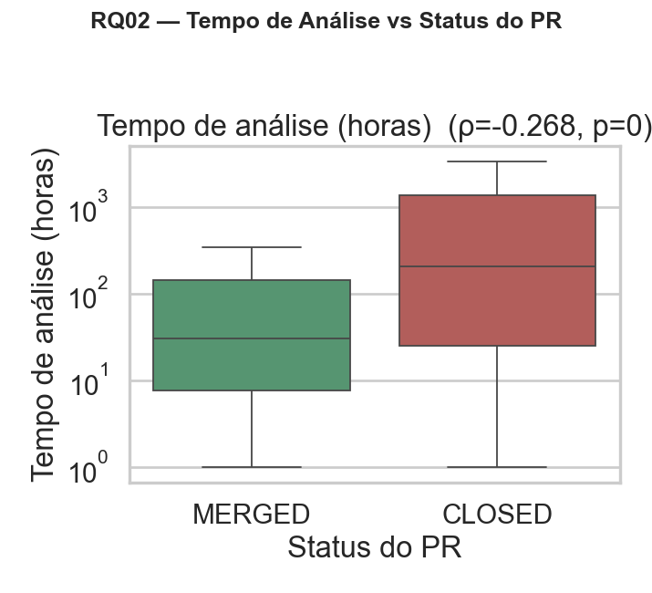
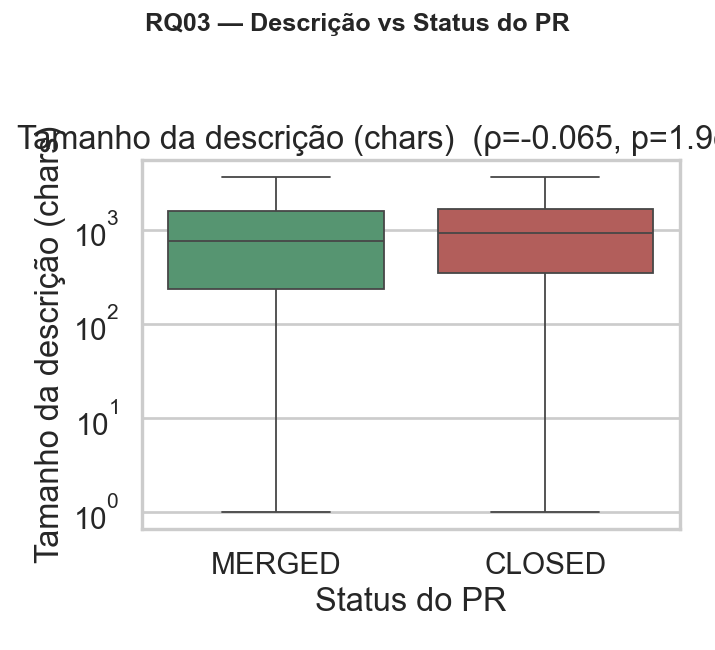
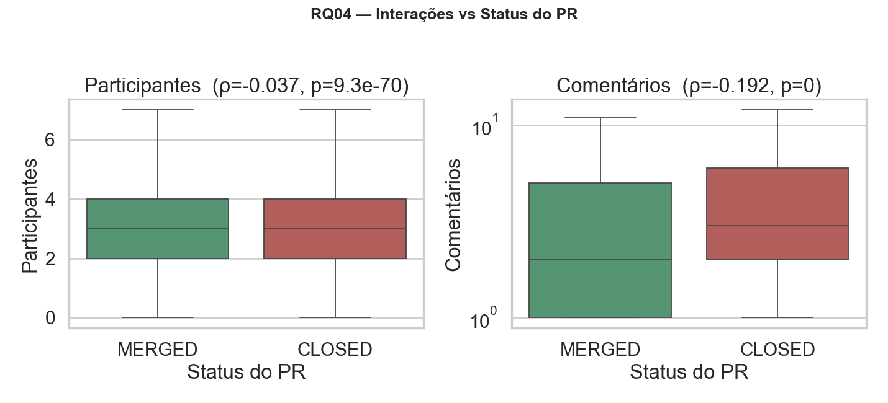
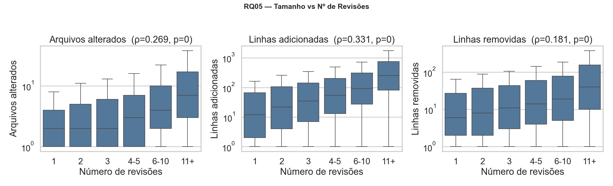
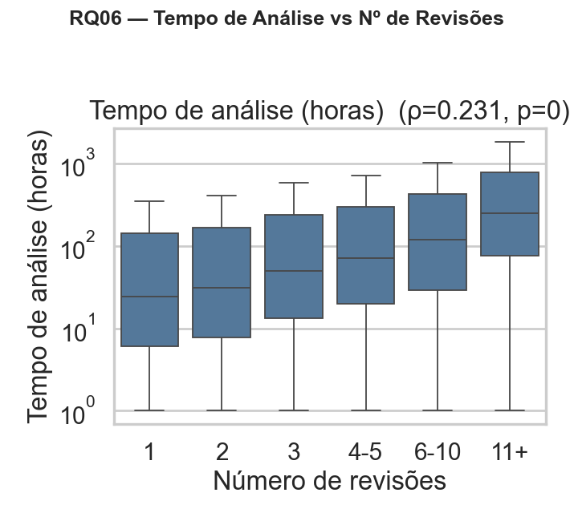
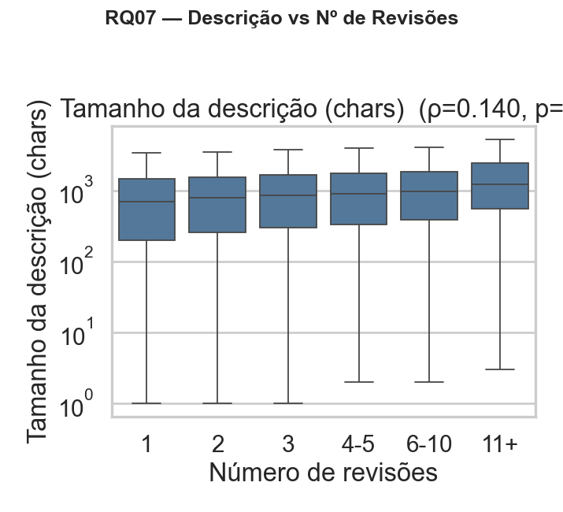
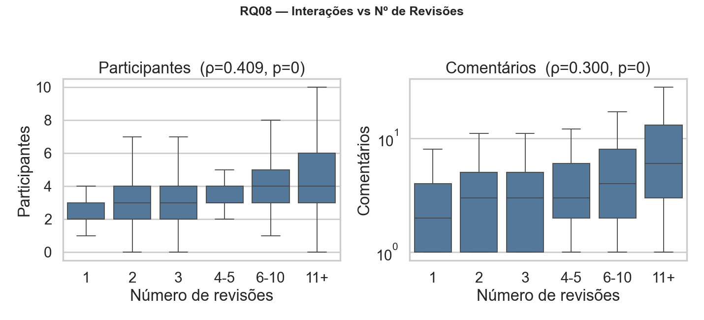

# Laboratório 03 — Caracterizando a atividade de code review no GitHub

**Disciplina:** Laboratório de Experimentação de Software — PUC Minas
**Dataset analisado:** 225.684 PRs coletados de 198 repositórios populares do GitHub (top 200 com ≥ 100 PRs MERGED+CLOSED, filtrando PRs com ao menos 1 revisão e tempo de análise ≥ 1 h).

---

## 1. Introdução e Hipóteses Informais

A prática de *code review* tornou-se central no desenvolvimento de software open source, em especial no GitHub, onde ocorre via Pull Requests (PRs). Este laboratório investiga quais variáveis se associam ao **feedback final da revisão** (PR ser MERGED ou CLOSED) e ao **número de revisões** que um PR recebe, em duas dimensões: tamanho, tempo de análise, descrição e interações.

Antes de olhar os dados, levantamos as seguintes hipóteses:

| RQ | Hipótese inicial |
|---|---|
| **RQ01** Tamanho × Status | PRs maiores tendem a ser **rejeitados** (CLOSED) com mais frequência por dificultarem a revisão. |
| **RQ02** Tempo × Status | PRs que demoram muito a fechar tendem a ser **CLOSED** — "morrem" sem merge. |
| **RQ03** Descrição × Status | Descrições mais ricas levariam a **mais merges**, pois facilitam o entendimento do revisor. |
| **RQ04** Interações × Status | Mais comentários/participantes indicariam **conflito**, correlacionando-se com CLOSED. |
| **RQ05** Tamanho × Nº Revisões | PRs maiores demandam **mais revisões**. |
| **RQ06** Tempo × Nº Revisões | PRs com mais revisões levam **mais tempo** para fechar. |
| **RQ07** Descrição × Nº Revisões | Descrições maiores reduziriam a necessidade de revisões adicionais (correlação **negativa**). |
| **RQ08** Interações × Nº Revisões | Mais participantes/comentários implicam **mais revisões**. |

---

## 2. Metodologia

### 2.1 Coleta
Implementada em três estágios (`coleta_repositorios.py` → `coleta_prs.py` → `extrai_metricas.py`), via API GraphQL do GitHub. Filtros aplicados conforme o enunciado: status MERGED/CLOSED, ≥ 1 revisão, intervalo entre criação e fechamento > 1 h.

### 2.2 Métricas
- **Tamanho**: `files_changed`, `additions`, `deletions`.
- **Tempo de análise**: `analysis_time_hours` (createdAt → mergedAt|closedAt, em horas).
- **Descrição**: `body_length` (caracteres do corpo markdown).
- **Interações**: `participants`, `comments`.
- **Alvo A** (RQ01–04): `state` (MERGED=1, CLOSED=0).
- **Alvo B** (RQ05–08): `reviews_count`.

### 2.3 Testes Estatísticos
- **Correlação de Spearman (ρ)** para todas as RQs. **Justificativa:** as métricas de PR apresentam distribuições fortemente assimétricas, com caudas longas e outliers (e.g., PRs de milhares de linhas), violando a normalidade exigida por Pearson. Spearman opera sobre postos e mede associação **monotônica**, sendo robusto a esses desvios.
- **Mann-Whitney U** complementar para RQ01–04, comparando as distribuições de cada métrica entre os grupos MERGED e CLOSED (apropriado para variável-alvo categórica).
- Adicionalmente reportamos as **medianas** por grupo, conforme exigido pelo enunciado.

### 2.4 Scripts
- `analise_rqs.py` — gera `data/rqs_medianas.csv`, `data/rqs_correlacoes.csv`, `data/rqs_mannwhitney.csv`.
- `plots_rqs.py` — gera as figuras em `figures/`.

---

## 3. Visão geral do dataset



- **MERGED:** 179.302 PRs (79,4 %)
- **CLOSED:** 46.382 PRs (20,6 %)
- Mediana global de **revisões por PR:** 2 (MERGED) vs 1 (CLOSED).

---

## 4. Resultados

> Convenção: ρ = coeficiente de Spearman. Com n ≈ 225 mil, mesmo correlações pequenas atingem p-valor extremamente baixo; portanto, interpretamos a **magnitude** de ρ, não apenas a significância.
> Faixas qualitativas usuais: |ρ| < 0,10 desprezível · 0,10–0,30 fraca · 0,30–0,50 moderada · > 0,50 forte.

### Dimensão A — Feedback Final das Revisões

#### RQ 01 — Tamanho × Status



| Métrica | Mediana MERGED | Mediana CLOSED | ρ Spearman | p-valor |
|---|---:|---:|---:|---:|
| files_changed | 2 | 2 | +0,050 | < 0,001 |
| additions     | 24 | 32 | −0,027 | < 0,001 |
| deletions     | 5 | 3 | +0,101 | < 0,001 |

**Resultado:** As correlações são **desprezíveis**. PRs MERGED e CLOSED têm medianas de tamanho muito próximas. Há leve tendência de PRs CLOSED terem **mais linhas adicionadas** (mediana 32 vs 24), o que sugere que adições grandes pesam ligeiramente contra o merge — mas o efeito é minúsculo.

#### RQ 02 — Tempo de Análise × Status



| Métrica | Mediana MERGED | Mediana CLOSED | ρ Spearman | p-valor |
|---|---:|---:|---:|---:|
| analysis_time_hours | 30,5 h | 209,7 h | **−0,268** | < 0,001 |

**Resultado:** **Correlação negativa fraca-moderada** — a mais expressiva entre as RQs A. PRs CLOSED ficam abertos quase **7× mais tempo** (mediana) do que os MERGED. Confirma a hipótese: PRs que arrastam tendem a "morrer".

#### RQ 03 — Descrição × Status



| Métrica | Mediana MERGED | Mediana CLOSED | ρ Spearman | p-valor |
|---|---:|---:|---:|---:|
| body_length | 687 | 875 | −0,065 | < 0,001 |

**Resultado:** Correlação **desprezível**. Curiosamente, PRs CLOSED têm descrições **ligeiramente maiores** (mediana 875 vs 687 caracteres) — o oposto da hipótese inicial. Possível leitura: contribuições problemáticas geram descrições mais longas para tentar justificar mudanças extensas/controversas.

#### RQ 04 — Interações × Status



| Métrica | Mediana MERGED | Mediana CLOSED | ρ Spearman | p-valor |
|---|---:|---:|---:|---:|
| participants | 3 | 3 | −0,037 | < 0,001 |
| comments     | 1 | 3 | **−0,192** | < 0,001 |

**Resultado:** Número de participantes praticamente não discrimina os grupos. Já o número de **comentários** mostra correlação **negativa fraca** clara: PRs CLOSED têm o **triplo** da mediana de comentários (3 vs 1). Mais discussão correlaciona-se com rejeição — coerente com a hipótese.

---

### Dimensão B — Número de Revisões

#### RQ 05 — Tamanho × Nº Revisões



| Métrica | ρ Spearman | p-valor |
|---|---:|---:|
| files_changed | **+0,269** | < 0,001 |
| additions     | **+0,331** | < 0,001 |
| deletions     | +0,181 | < 0,001 |

**Resultado:** Correlações **positivas fracas-moderadas**. Quanto maior o PR (sobretudo em linhas adicionadas), mais revisões ele acumula. Hipótese confirmada.

#### RQ 06 — Tempo de Análise × Nº Revisões



| Métrica | ρ Spearman | p-valor |
|---|---:|---:|
| analysis_time_hours | **+0,231** | < 0,001 |

**Resultado:** Correlação **positiva fraca**. PRs com mais revisões tendem a ficar mais tempo abertos — esperado, já que cada rodada de revisão consome dias.

#### RQ 07 — Descrição × Nº Revisões



| Métrica | ρ Spearman | p-valor |
|---|---:|---:|
| body_length | +0,140 | < 0,001 |

**Resultado:** Correlação **positiva fraca**. Descrições mais longas associam-se a **mais** revisões — o oposto da hipótese (esperávamos sinal negativo). Provavelmente reflete que PRs mais complexos exigem tanto descrições maiores quanto mais rodadas de revisão.

#### RQ 08 — Interações × Nº Revisões



| Métrica | ρ Spearman | p-valor |
|---|---:|---:|
| participants | **+0,409** | < 0,001 |
| comments     | **+0,300** | < 0,001 |

**Resultado:** Maiores correlações de todo o estudo. **Moderadas e positivas** — quanto mais participantes e comentários, mais revisões. Coerente: discussão e revisão andam juntas.

---

## 5. Discussão (Hipóteses × Resultados)

| RQ | Hipótese | Resultado | Confirmada? |
|---|---|---|---|
| **RQ01** | PRs maiores → mais CLOSED | Efeito desprezível (ρ ≤ \|0,10\|) | **Não** |
| **RQ02** | Tempo longo → CLOSED | ρ = −0,268; mediana CLOSED 7× maior | **Sim** |
| **RQ03** | Descrição rica → MERGED | Sinal oposto, fraco | **Não** |
| **RQ04** | Mais interação → CLOSED | ρ = −0,192 para comentários | **Parcial** (sim para comments, não para participants) |
| **RQ05** | Tamanho → mais revisões | ρ até +0,33 | **Sim** |
| **RQ06** | Mais revisões → mais tempo | ρ = +0,231 | **Sim** |
| **RQ07** | Descrição maior → menos revisões | Sinal oposto, fraco | **Não** |
| **RQ08** | Mais interações → mais revisões | ρ até +0,41 | **Sim** |

### Observações principais

1. **Tamanho do PR pouco discrimina aceitação, mas explica nº de revisões.** O *quanto* foi escrito não é determinante para um PR ser aprovado ou rejeitado — quase todos os PRs analisados são pequenos (mediana de 2 arquivos) — mas claramente influencia quantas rodadas de revisão são necessárias.

2. **Tempo é o melhor preditor de rejeição.** Foi a única métrica com correlação consistente e expressiva contra `state`. PRs que ficam dias/semanas abertos são marcadamente os que terminam CLOSED.

3. **Descrição não funciona como esperado.** Em ambas as direções, a hipótese de que "boa documentação ajuda" não se sustentou: PRs longos em descrição são levemente mais rejeitados e exigem mais revisões. A interpretação mais plausível é que **complexidade da contribuição** explica simultaneamente os três fenômenos (descrição maior, mais revisões, mais chance de rejeição).

4. **Interações são o melhor preditor de nº de revisões.** Faz sentido prático: cada nova revisão é tipicamente acompanhada por novos comentários e, frequentemente, novos participantes na discussão.

5. **Comentários ≠ participantes.** Apesar de pertencerem à mesma dimensão, comportam-se distintamente: número de **comentários** distingue MERGED/CLOSED; número de **participantes** quase não.

### Ameaças à validade
- **Granularidade temporal:** o filtro de ≥ 1 hora é um proxy imperfeito para "revisão humana" — PRs revisados rapidamente por humanos são excluídos.
- **Confounding:** complexidade do código não é diretamente medida; várias correlações observadas podem ser reflexo dela.
- **Domínio:** análise restrita aos top 200 repositórios mais populares — generalização para projetos menores deve ser feita com cautela.

---

## 6. Reprodutibilidade

```powershell
cd Laboratorios/Lab-03
pip install -r requirements.txt
python analise_rqs.py    # gera CSVs em data/
python plots_rqs.py      # gera PNGs em figures/
```

Artefatos gerados:
- `data/rqs_medianas.csv`, `data/rqs_correlacoes.csv`, `data/rqs_mannwhitney.csv`
- `figures/overview_status.png` + 8 PNGs (um por RQ)
