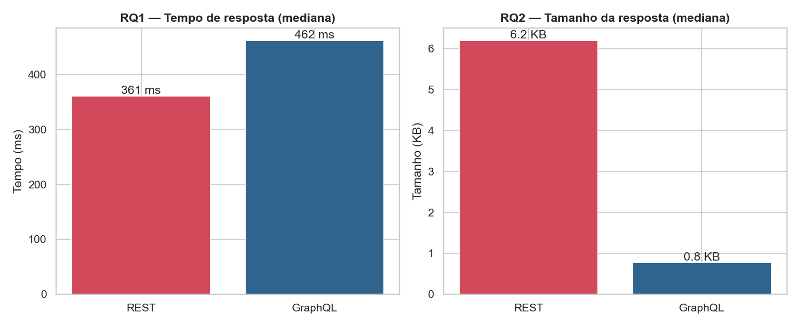
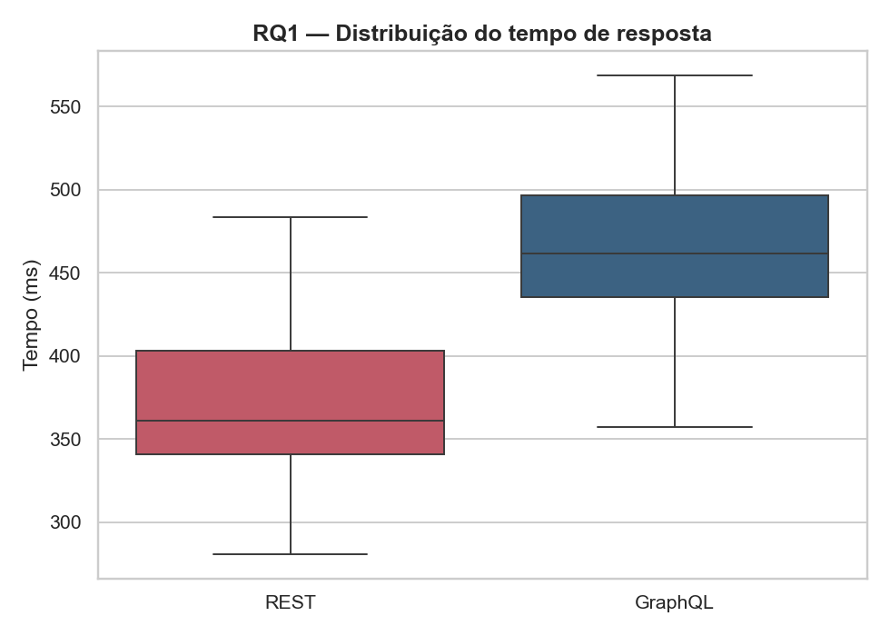
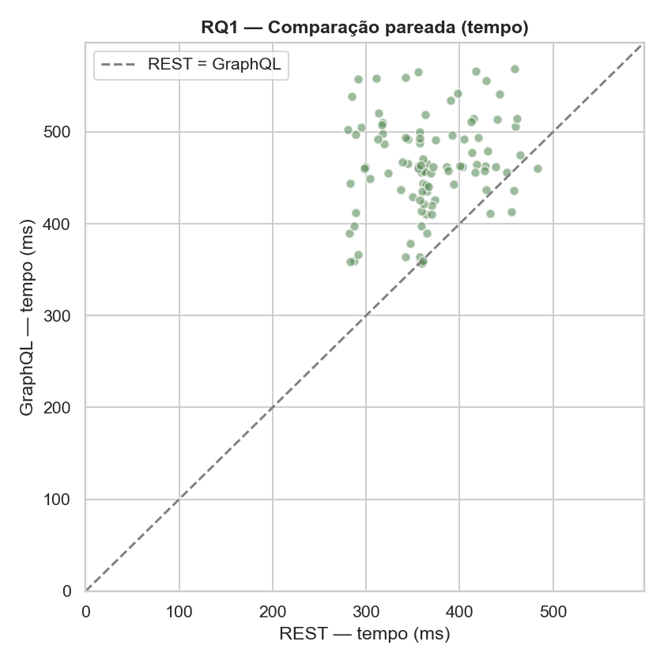
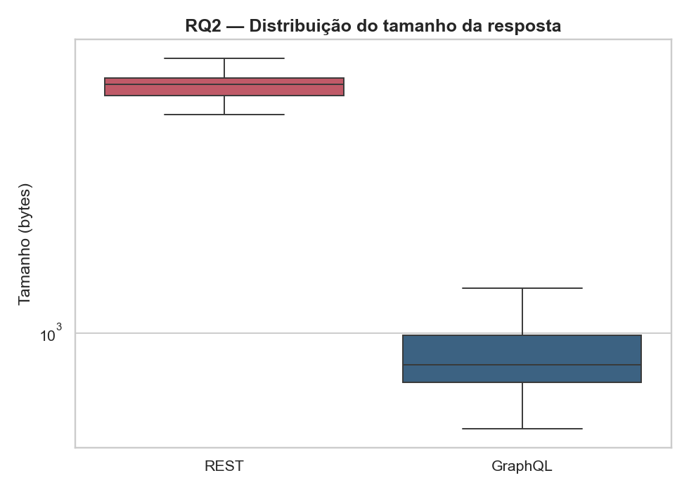
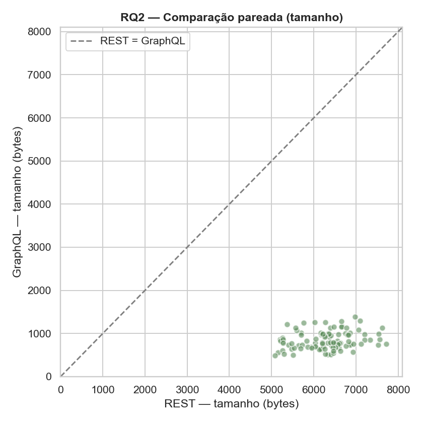

# Lab 05 — Relatório Final

## GraphQL vs REST — Um experimento controlado

Disciplina: Laboratório de Experimentação de Software · PUC Minas
Sprints Lab05S02 (execução, análise e relatório) e Lab05S03 (dashboard).

---

## (i) Introdução e hipóteses

GraphQL, proposta pelo Facebook, é uma linguagem de consulta para APIs Web que
permite ao cliente especificar exatamente os campos desejados, em contraste com
APIs REST, baseadas em *endpoints* que retornam representações pré-definidas dos
recursos. Não é claro, porém, quais os reais benefícios de adotar GraphQL no
lugar de REST. Este experimento controlado avalia quantitativamente dois desses
possíveis benefícios — **tempo** e **tamanho** das respostas — usando a API
pública do GitHub, que oferece as duas abordagens sobre a mesma base de dados.

**Perguntas de pesquisa e hipóteses** (testes bicaudais; ver
`DESENHO_EXPERIMENTO.md` para o desenho completo):

- **RQ1 — Tempo:** respostas GraphQL são mais rápidas que REST?
  - H0₁: `mediana(tempo_GraphQL) = mediana(tempo_REST)`
  - H1₁: `mediana(tempo_GraphQL) ≠ mediana(tempo_REST)`
- **RQ2 — Tamanho:** respostas GraphQL têm tamanho menor que REST?
  - H0₂: `mediana(tam_GraphQL) = mediana(tam_REST)`
  - H1₂: `mediana(tam_GraphQL) ≠ mediana(tam_REST)`

---

## (ii) Metodologia

### Desenho

Experimento **pareado (within-subject)**: cada repositório (bloco) recebe os
dois tratamentos, controlando a variabilidade entre objetos.

- **Fator (variável independente):** tipo de API — níveis `REST` e `GraphQL`.
- **Variáveis dependentes:** tempo de resposta (`tempo_ms`, latência ponta a
  ponta) e tamanho do corpo da resposta (`tamanho_bytes`).
- **Tratamentos equivalentes:**
  - **REST:** `GET https://api.github.com/repos/{owner}/{repo}`.
  - **GraphQL:** `POST https://api.github.com/graphql` com uma *query* sobre
    `repository(owner, name)` solicitando **exatamente os mesmos campos**
    consumidos da resposta REST (nome, dono, descrição, estrelas, forks,
    watchers, issues abertas, linguagem, datas, tamanho em disco, licença,
    branch padrão, homepage e topics).

### Objetos experimentais

Amostra de **100 repositórios públicos mais populares** do GitHub (ordenados por
número de estrelas), coletados via API GraphQL de busca
(`scripts/coletar_repos.py` → `data/repositorios.json`).

### Procedimento de medição

Para cada repositório e cada API: uma requisição de **aquecimento**
(descartada) seguida de **5 repetições medidas**, com a **ordem dos tratamentos
intercalada** por repetição e pausa de 0,15 s entre requisições. Para cada par
(repositório, API) usa-se a **mediana das repetições** como valor
representativo, reduzindo o ruído de rede. Isso resulta em **100 pares**
pareados por métrica.

- Total planejado: 100 repos × 2 APIs × 5 repetições = 1.000 requisições.
- Total efetivamente coletado: **999 medições válidas** (uma requisição
  isolada falhou e foi descartada).

### Análise estatística

Como as latências não seguem distribuição normal e o desenho é pareado, usou-se
o **teste não-paramétrico de Wilcoxon para amostras pareadas** (GraphQL vs REST,
α = 0,05). O tamanho do efeito é reportado via **Cliff's delta** e pela
**redução percentual da mediana**.

### Ambiente de execução (reprodutibilidade)

| Item | Valor |
|------|-------|
| Sistema operacional | macOS 15.7.5 (Darwin 24.6.0), x86_64 |
| Python | 3.9.6 |
| Bibliotecas | requests, pandas, numpy, scipy, matplotlib, seaborn |
| APIs | GitHub REST v3 e GitHub GraphQL v4 |
| Autenticação | Personal Access Token (rate limit de 5.000 req/h) |
| Repetições / pausa | 5 medidas + 1 warm-up · 0,15 s entre requisições |

Os scripts (`coletar_repos.py`, `benchmark.py`, `analise.py`, `dashboard.py`)
permitem reproduzir integralmente o experimento — ver `README.md`.

---

## (iii) Resultados

### Estatísticas descritivas (mediana por repositório, n = 100)

| API | Tempo médio (ms) | Tempo mediano (ms) | Desvio (ms) | Tam. médio (bytes) | Tam. mediano (bytes) | Desvio (bytes) |
|-----|-----------------:|-------------------:|------------:|-------------------:|---------------------:|---------------:|
| REST    | 366,99 | 361,02 | 50,58 | 6287,30 | 6343,0 | 620,58 |
| GraphQL | 462,78 | 461,81 | 52,21 |  840,31 |  787,5 | 206,82 |

### RQ1 — Tempo de resposta

| Métrica | Valor |
|---------|------:|
| Mediana REST | 361,02 ms |
| Mediana GraphQL | 461,81 ms |
| Diferença (GraphQL − REST) | +100,79 ms |
| Variação da mediana (GraphQL vs REST) | **+27,9% (mais lento)** |
| Estatística de Wilcoxon | 54,0 |
| **p-valor** | **1,96 × 10⁻¹⁷** |
| Significativo (α = 0,05)? | **Sim** |
| Cliff's delta | 0,802 (efeito **grande**) |

Rejeita-se H0₁: há diferença estatisticamente significativa. **GraphQL foi mais
lento** que REST nesta consulta — o oposto da hipótese de que GraphQL seria mais
rápido.

### RQ2 — Tamanho da resposta

| Métrica | Valor |
|---------|------:|
| Mediana REST | 6343,0 bytes |
| Mediana GraphQL | 787,5 bytes |
| Diferença (GraphQL − REST) | −5555,5 bytes |
| Redução da mediana (GraphQL vs REST) | **−87,6% (menor)** |
| Estatística de Wilcoxon | 0,0 |
| **p-valor** | **3,90 × 10⁻¹⁸** |
| Significativo (α = 0,05)? | **Sim** |
| Cliff's delta | −1,000 (efeito **grande / máximo**) |

Rejeita-se H0₂: há diferença estatisticamente significativa. **GraphQL produziu
respostas muito menores** que REST — confirmando a hipótese. O Cliff's delta de
−1,0 indica que, em **todos** os 100 pares, a resposta GraphQL foi menor que a
REST.

---

## (iv) Discussão

**RQ1 (tempo): GraphQL NÃO foi mais rápido — foi ~28% mais lento.** Para a
leitura de um único recurso (um repositório), o *endpoint* REST do GitHub é
altamente otimizado e cacheável, enquanto a requisição GraphQL incorre em custo
adicional de parsing/resolução da *query* e montagem dinâmica da resposta no
servidor. Como a necessidade de informação cabia em **uma única chamada REST**,
o cenário não explora o ponto forte do GraphQL (evitar *over-fetching* e
múltiplas chamadas — o problema de *N+1 requests*). É plausível que, em cenários
com dados aninhados que em REST exigiriam várias requisições, o GraphQL reduza a
latência total — o que não foi o caso aqui.

**RQ2 (tamanho): GraphQL foi drasticamente menor (−87,6%), de forma consistente
em 100% dos pares.** Esse é o benefício central e esperado do GraphQL: o cliente
recebe **apenas os campos solicitados**, enquanto a resposta REST do GitHub
inclui dezenas de campos e URLs adicionais não requisitados (*over-fetching*).
A economia de banda é expressiva e relevante para clientes móveis ou de alto
volume.

**Conclusão.** Os benefícios do GraphQL **não são universais**: ele oferece
ganho claro e robusto em **tamanho de payload**, mas, para consultas simples de
um único recurso, pode ter **maior latência** que um *endpoint* REST otimizado.
A escolha entre as abordagens deve considerar o padrão de acesso: GraphQL tende
a compensar quando há *over-fetching* significativo ou agregação de múltiplos
recursos em uma só requisição.

**Ameaças à validade.** Os resultados restringem-se a uma única necessidade de
informação (metadados de um repositório) e a repositórios muito populares; a
latência inclui variação de rede (mitigada por repetições, mediana, intercalação
e warm-up). Ver `DESENHO_EXPERIMENTO.md` para a análise completa de ameaças.

---

## Artefatos

- Desenho do experimento: `DESENHO_EXPERIMENTO.md`
- Dados brutos: `data/medicoes.csv` (999 medições)
- Tabelas-resumo: `data/resumo_descritivo.csv`, `data/testes_estatisticos.csv`, `data/pares.csv`
- Figuras: `figures/`
- Dashboard: `dashboard/dashboard_lab05.html`
